# ZJU-blockchain-course-2025

⬆ 可以️修改成你自己的项目名。

> 第二次作业要求（以下内容提交时可以删除）：
> 
> 进阶的去中心化彩票系统，参与方包括：竞猜玩家、公证人
>
> **背景**：传统的体育彩票系统（例如我国的体育彩票）一般没有彩票交易功能：例如，对于“NBA本赛季MVP为某球员/F1的赛季总冠军为某车队”这类持续时间长的事件的下注一般在赛季开始前就会买定离手，这使得一旦出现突发或不确定事件（如球员A赛季报销/球队B买入强力球星/C车队车手受伤等），很多玩家的选择便会立即失去意义，导致彩票游戏的可玩性下降。因此，一个有趣的探索方向是让彩票系统拥有合规、方便的交易功能。
>
> 建立一个进阶的去中心化彩票系统（可以是体育彩票，或其它任何比赛节目的竞猜，例如《中国好声音》《我是歌手》年度总冠军等，可以参考 [Polymarket](https://polymarket.com/) ），在网站中：
> - 公证人（你自己）可以创立许多竞猜项目：例如某场比赛的输赢、年度总冠军的得主等，每个项目应当有2个或多个可能的选项，一定的彩票总金额（由公证人提供），以及规定好的结果公布时间。
> - 玩家首先领取到测试所需以太币。在网站中，对于一个竞猜项目和多个可能的选项：
>   1. 每个竞彩玩家都可以选择其中的某个选项并购买一定金额（自己定义）的彩票，购买后该玩家会获得一张对应的彩票凭证（一个 ERC721 合约中的 Token）
>   2. 在竞彩结果公布之前，任何玩家之间可以买卖他们的彩票，以应对项目进行期间的任何突发状况。具体的买卖机制如下：一个玩家可以以指定的金额挂单出售（ERC721 Delegate）自己的彩票，其它玩家如果觉得该彩票有利可图就可以买入他的彩票。双方完成一次 ERC721 Token 交易。
>   3. 公证人可以在时间截止时（简单起见，你可以随时终止项目）输入竞猜的结果并进行结算。所有胜利的玩家可以平分奖池中的金额。
> - Bonus（最多5分，若想要完成，可以直接将功能整合进上述要求中）：
>   1. （2分）发行一个 ERC20 合约，允许用户领取 ERC20 积分，并使用ERC20积分完成上述流程。
>   2. （3分）对交易彩票的过程实现一个简单的链上订单簿：卖方用户可以以不同价格出售一种彩票，网页上显示当前订单簿的信息（多少价格有多少该彩票正在出售）。其他用户可以根据最优价格购买彩票。
> - 可以对上述需求进行合理更改和说明。请大家专注于功能实现，网站UI美观程度不纳入评分标准，能让用户能够舒适操作即可。

**以下内容为作业仓库的README.md中需要描述的内容。请根据自己的需要进行修改并提交。**

作业提交方式为：**提交视频文件**和**仓库的链接**到指定邮箱。

## 如何运行

补充如何完整运行你的应用。

1. 在本地启动ganache应用。

2. 在 `./contracts` 中安装需要的依赖，运行如下的命令：
    ```bash
    npm install
    ```
3. 在 `./contracts` 中编译合约，运行如下的命令：
    ```bash
    npx hardhat compile
    ```
    得到的地址后续用于连接网页
4. 在 `./contracts` 中部署合约，运行如下的命令：
   ```bash
   npx hardhat run ./scripts/deploy.ts --network ganache
   ```
5. 在`contracts/hardhat.config.ts`里加入`ganache`内的账号，在`deploy.ts`内连接区块链，默认端口`localhost:8545`，若无必要，可不更改。在`house-nft/src/utils/contract-addresses.json`内填入刚刚部署合约时记录的地址.在 `./frontend` 中安装需要的依赖，运行如下的命令：
    ```bash
    npm install
    ```
7. 在 `./frontend` 中启动前端程序，运行如下的命令：
    ```bash
    npm run start
    ```

## 功能实现分析

1. 管理员(manager)可以创立许多竞猜项目，并为每个项目设立2个或多个可能的选项，初始的奖池金额以及预定的结果公布时间。其他用户首先领取到测试所需ZJU Token。
2. 在网站中，对于一个竞猜项目和多个可能的选项：
* 每个用户都可以选择其中的某个选项并购买一定金额（自己定义）的彩票，购买后该玩家会获得一张对应的彩票凭证（一个 ERC721 合约中的 Token）
* 在竞彩结果公布之前，任何用户之间可以选择买卖他们的彩票：用户可以以指定的金额挂单出售自己的彩票并可以在售出之前取消出售；其它玩家如果觉得该彩票有利可图就可以买入他的彩票。双方完成一次 ERC721 Token 交易。
3. 管理员可以在时间截止前（简单起见，项目中可以随时终止竞赛）输入竞猜的结果并进行结算。所有胜利的玩家可以平分奖池中的金额，每张胜利彩票管理员会收取1积分作为消耗。  
Bonus：  
1.（2分）发行一个 ERC20 合约，允许用户领取 ERC20 积分，并使用ERC20积分完成上述流程。
* 已自己发行muERC20货币并在contracts中调用。  
2.（3分）对交易彩票的过程实现一个简单的链上订单簿：卖方用户可以以不同价格出售一种彩票，网页上显示当前订单簿的信息（多少价格有多少该彩票正在出售）。其他用户可以根据最优价格购买彩票。
* 已构建对话框，用户可根据选择的竞赛和选项获取所有彩票并自由选购。

## 项目运行截图

1. 连接钱包
   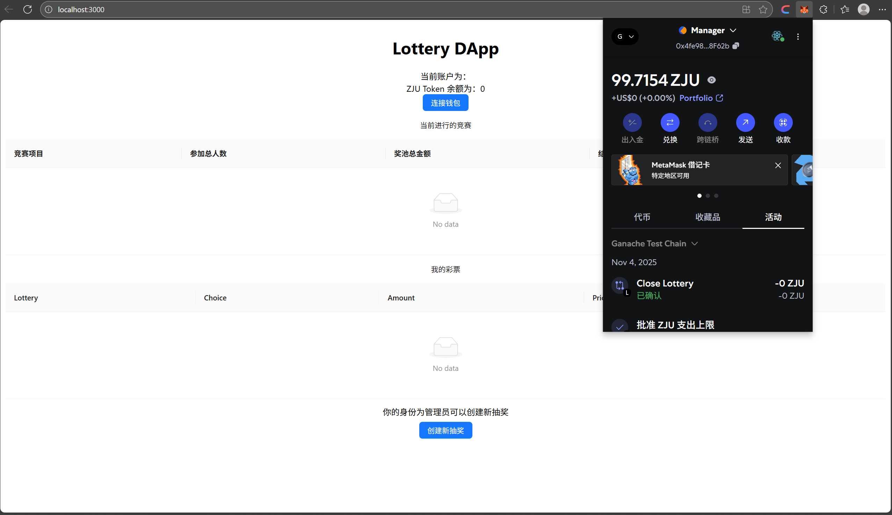
   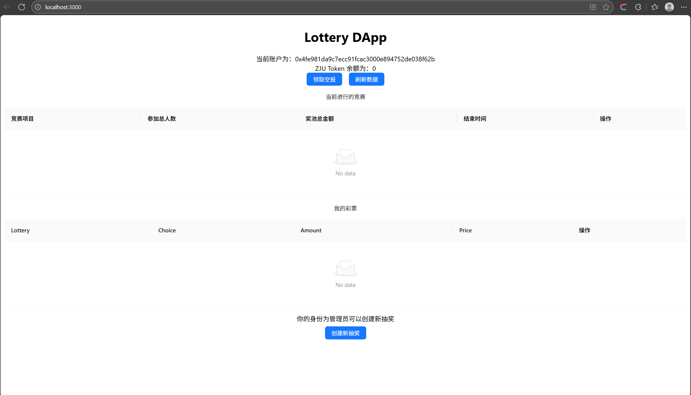
2. 领取空投
   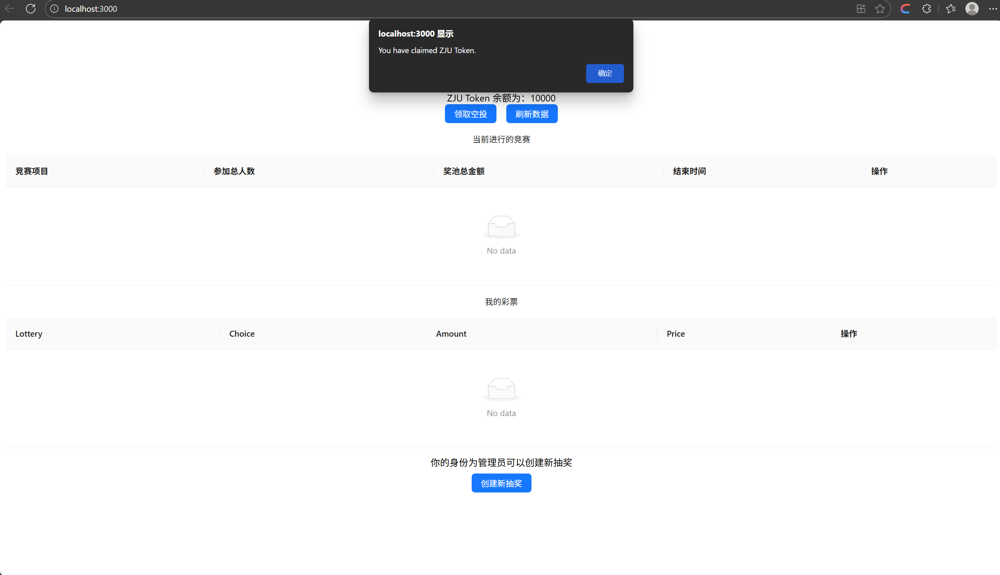
3. 新建竞赛
   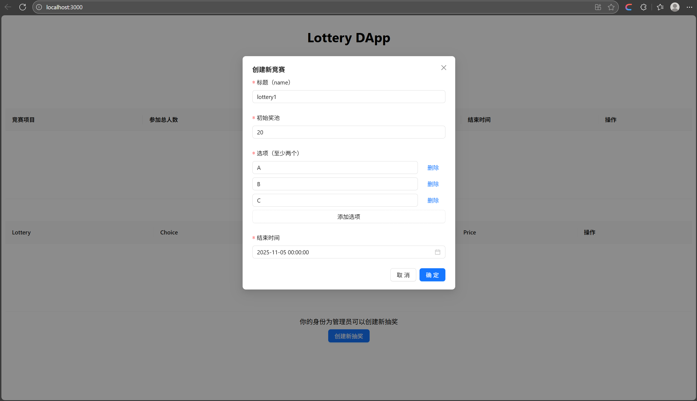
   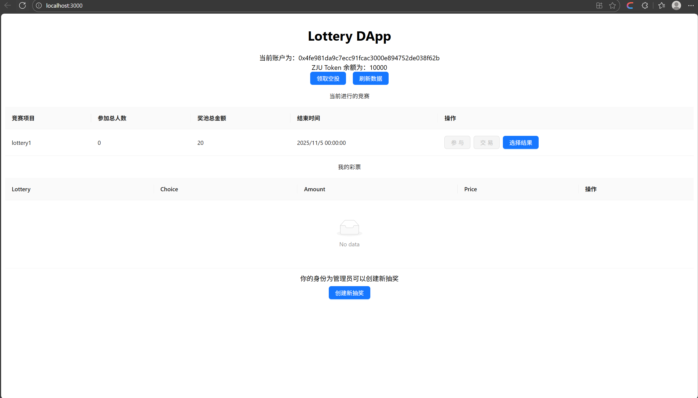
4. 新建彩票
   
   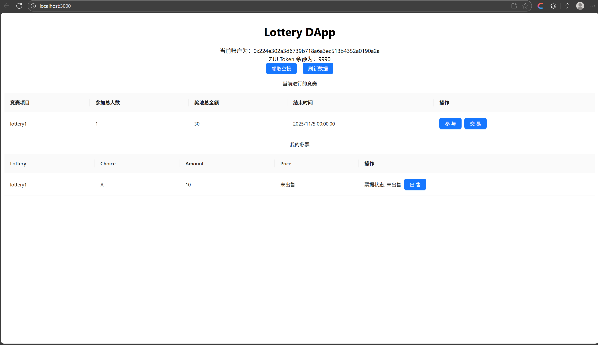
   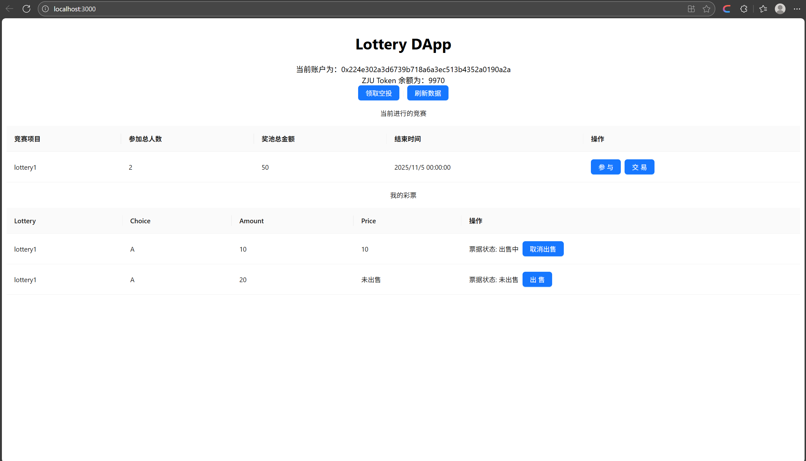
5. 彩票交易
   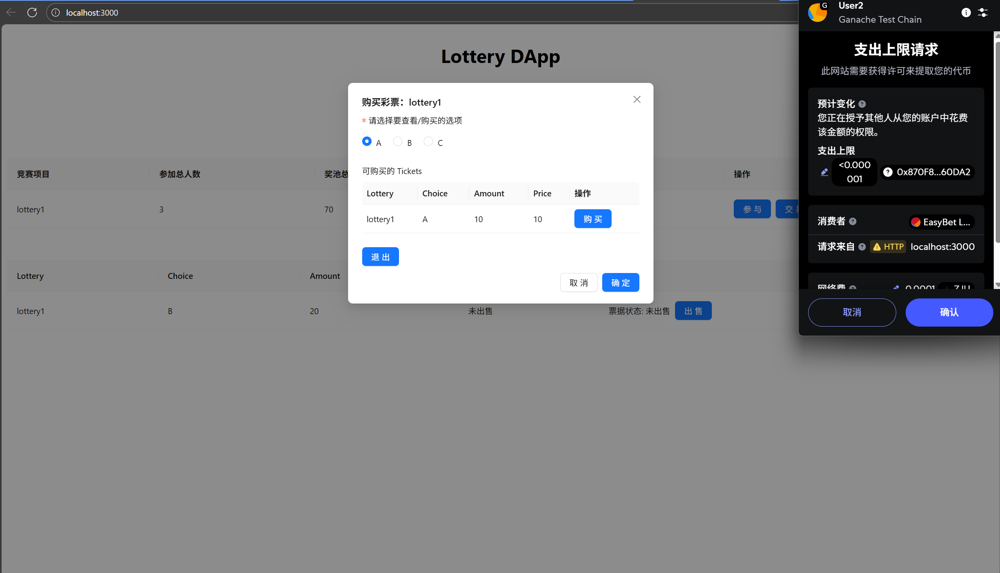
   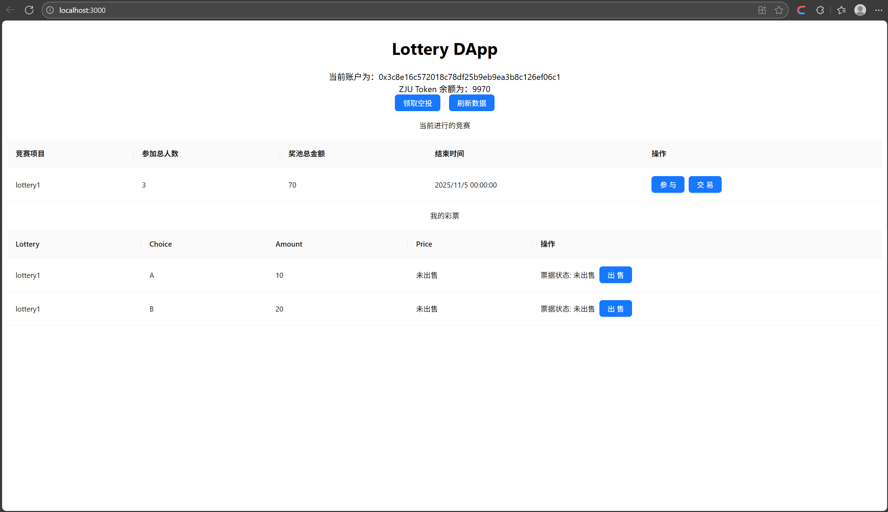
6. 竞赛结算
   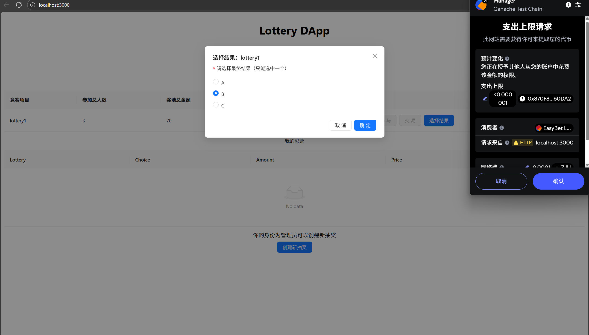
   
   
   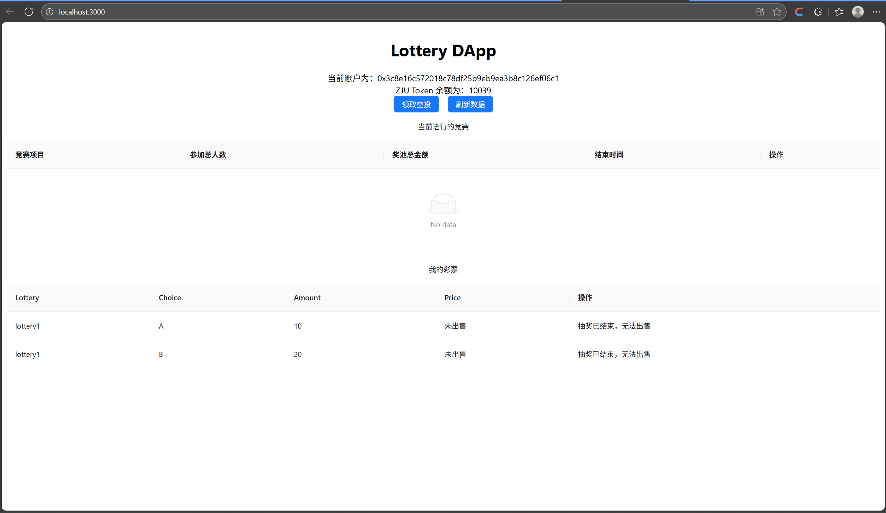

## 参考内容

- 课程的参考Demo见：[DEMOs](https://github.com/LBruyne/blockchain-course-demos)。

- 快速实现 ERC721 和 ERC20：[模版](https://wizard.openzeppelin.com/#erc20)。记得安装相关依赖 ``"@openzeppelin/contracts": "^5.0.0"``。

- 如何实现ETH和ERC20的兑换？ [参考讲解](https://www.wtf.academy/en/docs/solidity-103/DEX/)

如果有其它参考的内容，也请在这里陈列。  
AI使用情况：处理了一些框架构建过程中的问题；frontend文件中json文件接口代码的生成；一些用于检查错误的输出代码。
