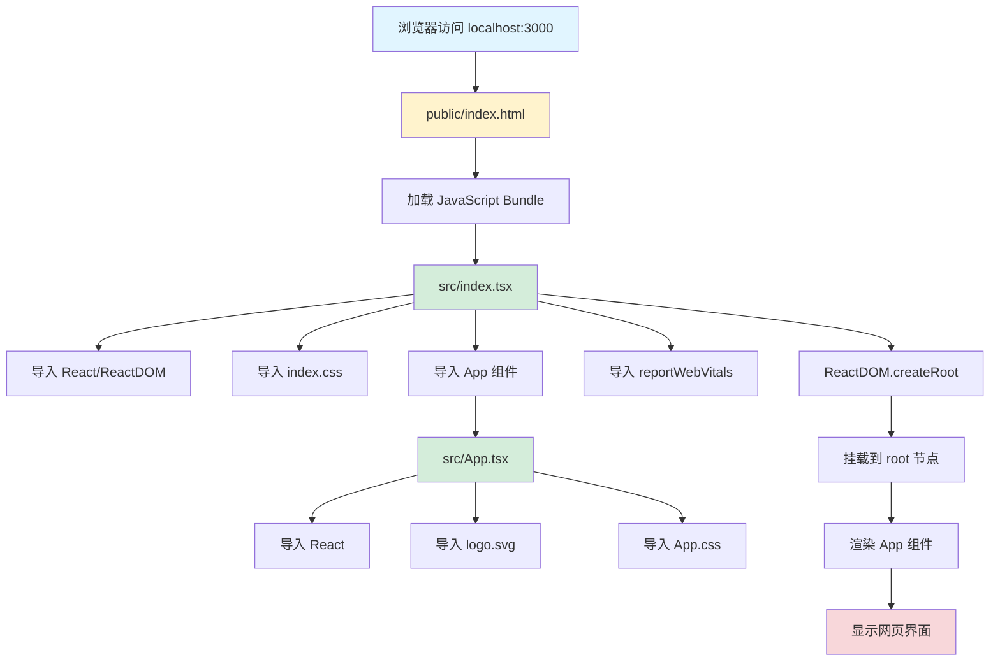

# Frontend 文件调用关系图

## 📊 完整调用关系图



## 🔄 详细执行流程

### 1. 初始化阶段

```
┌─────────────────────────────────────────────────────────┐
│  1. 用户访问 http://localhost:3000                      │
└─────────────────────────────────────────────────────────┘
                           ↓
┌─────────────────────────────────────────────────────────┐
│  2. Webpack Dev Server 返回 public/index.html          │
│     <div id="root"></div>                              │
└─────────────────────────────────────────────────────────┘
                           ↓
┌─────────────────────────────────────────────────────────┐
│  3. 浏览器加载并执行打包后的 JavaScript                 │
│     (所有 src/ 文件已被打包成 bundle.js)                │
└─────────────────────────────────────────────────────────┘
```

### 2. 模块加载阶段

```
src/index.tsx 开始执行
│
├─→ import React from 'react'
│   └─→ 加载 React 核心库
│
├─→ import ReactDOM from 'react-dom/client'
│   └─→ 加载 React DOM 渲染器
│
├─→ import './index.css'
│   └─→ 全局样式注入到页面
│       • body 样式
│       • code 样式
│
├─→ import App from './App'
│   └─→ 加载 src/App.tsx
│       │
│       ├─→ import React from 'react'
│       │
│       ├─→ import logo from './logo.svg'
│       │   └─→ 加载 SVG 图片资源
│       │
│       └─→ import './App.css'
│           └─→ 组件样式注入
│               • .App 样式
│               • .App-header 样式
│               • 动画定义
│
└─→ import reportWebVitals from './reportWebVitals'
    └─→ 性能监控工具（可选执行）
```

### 3. 渲染阶段

```
┌──────────────────────────────────────────┐
│  const root = ReactDOM.createRoot(...)   │
│  创建 React 18 并发渲染根节点            │
└──────────────────────────────────────────┘
                    ↓
┌──────────────────────────────────────────┐
│  document.getElementById('root')         │
│  查找 HTML 中的 root 元素                │
└──────────────────────────────────────────┘
                    ↓
┌──────────────────────────────────────────┐
│  root.render(                            │
│    <React.StrictMode>                    │
│      <App />                             │
│    </React.StrictMode>                   │
│  )                                       │
└──────────────────────────────────────────┘
                    ↓
┌──────────────────────────────────────────┐
│  执行 App() 函数                         │
│  生成虚拟 DOM 树                         │
└──────────────────────────────────────────┘
                    ↓
┌──────────────────────────────────────────┐
│  React Reconciliation                    │
│  虚拟 DOM → 真实 DOM                     │
└──────────────────────────────────────────┘
                    ↓
┌──────────────────────────────────────────┐
│  页面显示完成                            │
│  用户看到 React 界面                     │
└──────────────────────────────────────────┘
```

## 🗂️ 文件依赖树

```
frontend/
│
├── public/
│   └── index.html ─────────┐
│                            │ (作为 HTML 模板)
│                            ↓
└── src/                 [注入打包文件]
    │
    ├── index.tsx ──────────────────┐ (应用入口)
    │   │                           │
    │   ├── imports ────────────────┤
    │   │   ├── React              │
    │   │   ├── ReactDOM            │
    │   │   ├── index.css ←────────┤── 全局样式
    │   │   ├── App ←──────────────┤── 主组件
    │   │   └── reportWebVitals ←──┤── 性能监控
    │   │                           │
    │   └── 执行 ───────────────────┤
    │       └── createRoot()        │
    │           └── render(<App />)  │
    │                               │
    ├── App.tsx ←───────────────────┘
    │   │
    │   ├── imports
    │   │   ├── React
    │   │   ├── logo.svg ←────────── 图片资源
    │   │   └── App.css ←─────────── 组件样式
    │   │
    │   └── exports
    │       └── function App()
    │           └── return JSX
    │
    ├── index.css
    ├── App.css
    ├── logo.svg
    ├── reportWebVitals.ts
    ├── setupTests.ts ──→ [测试配置]
    ├── App.test.tsx ───→ [组件测试]
    └── react-app-env.d.ts ─→ [类型定义]
```

## 🎨 样式层级关系

```
index.css (全局样式)
    ↓
┌─────────────────────────┐
│  body                   │  ← 全局 body 样式
│  - margin: 0           │
│  - font-family: ...    │
└─────────────────────────┘
    ↓
┌─────────────────────────┐
│  code                   │  ← 全局 code 样式
│  - font-family: mono   │
└─────────────────────────┘

App.css (组件样式)
    ↓
┌─────────────────────────┐
│  .App                   │  ← App 容器
│  - text-align: center  │
└─────────────────────────┘
    ↓
┌─────────────────────────┐
│  .App-header            │  ← 页面头部
│  - background: #282c34 │
│  - min-height: 100vh   │
└─────────────────────────┘
    ↓
┌─────────────────────────┐
│  .App-logo              │  ← Logo 图片
│  - animation: spin     │
└─────────────────────────┘
```

## 🔄 数据流向图

### 开发模式 (npm start)

```
┌──────────────┐
│  npm start   │
└──────┬───────┘
       ↓
┌──────────────────────────┐
│  react-scripts start     │
│  启动 Webpack Dev Server │
└──────┬───────────────────┘
       ↓
┌────────────────────────────────┐
│  编译 TypeScript → JavaScript │
│  打包所有模块到内存中         │
└──────┬─────────────────────────┘
       ↓
┌──────────────────────────┐
│  localhost:3000 启动     │
└──────┬───────────────────┘
       ↓
┌────────────────────────────┐
│  浏览器访问               │
│  ↓                        │
│  加载 index.html          │
│  ↓                        │
│  执行 bundle.js           │
│  ↓                        │
│  React 渲染页面           │
└────────────────────────────┘
       ↓
┌────────────────────────────┐
│  文件监听                 │
│  ↓                        │
│  检测到文件变化           │
│  ↓                        │
│  热模块替换 (HMR)         │
│  ↓                        │
│  页面局部刷新             │
└────────────────────────────┘
```

### 生产构建 (npm run build)

```
┌──────────────┐
│  npm run build│
└──────┬────────┘
       ↓
┌────────────────────────────┐
│  react-scripts build       │
│  生产模式 Webpack 打包     │
└──────┬─────────────────────┘
       ↓
┌────────────────────────────┐
│  优化处理                  │
│  • 代码压缩 (Minify)       │
│  • Tree Shaking            │
│  • 代码分割                │
│  • 资源哈希命名            │
└──────┬─────────────────────┘
       ↓
┌────────────────────────────┐
│  输出到 build/ 目录        │
│  • index.html              │
│  • static/js/*.js          │
│  • static/css/*.css        │
│  • static/media/*          │
└────────────────────────────┘
```

## 🧪 测试流程

```
npm test
    ↓
┌─────────────────────────┐
│  Jest 测试运行器         │
└──────┬──────────────────┘
       ↓
┌─────────────────────────┐
│  setupTests.ts          │
│  配置测试环境           │
└──────┬──────────────────┘
       ↓
┌─────────────────────────┐
│  App.test.tsx           │
│  执行组件测试           │
│  • render(<App />)      │
│  • 断言检查             │
└─────────────────────────┘
```

## 📦 模块打包过程

```
Webpack 入口: src/index.tsx
    │
    ├─→ 静态分析所有 import 语句
    │   └─→ 构建依赖图
    │
    ├─→ 处理各类文件
    │   ├─→ .tsx/.ts → TypeScript 编译 → JavaScript
    │   ├─→ .css → CSS Loader → Style Inject
    │   ├─→ .svg/.png → File Loader → URL
    │   └─→ .json → JSON Parse
    │
    ├─→ 打包成 bundle
    │   ├─→ main.[hash].js (主应用代码)
    │   ├─→ vendor.[hash].js (第三方库)
    │   └─→ runtime.[hash].js (Webpack 运行时)
    │
    └─→ 注入到 index.html
        └─→ <script src="/static/js/main.[hash].js">
```

## 🌐 React 组件渲染流程

```
用户操作/状态更新
    ↓
┌──────────────────────────┐
│  触发组件重新渲染         │
└──────┬───────────────────┘
       ↓
┌──────────────────────────┐
│  执行组件函数             │
│  function App() { ... }   │
└──────┬───────────────────┘
       ↓
┌──────────────────────────┐
│  生成新的虚拟 DOM        │
│  (JavaScript 对象树)     │
└──────┬───────────────────┘
       ↓
┌──────────────────────────┐
│  Diffing 算法            │
│  对比新旧虚拟 DOM        │
└──────┬───────────────────┘
       ↓
┌──────────────────────────┐
│  计算最小变更            │
│  (Reconciliation)        │
└──────┬───────────────────┘
       ↓
┌──────────────────────────┐
│  批量更新真实 DOM        │
│  (Commit Phase)          │
└──────┬───────────────────┘
       ↓
┌──────────────────────────┐
│  浏览器重绘/重排         │
│  用户看到更新后的界面    │
└──────────────────────────┘
```

## 🔧 配置文件作用域

```
tsconfig.json
    │
    ├─→ 编译所有 src/ 下的 .ts 和 .tsx 文件
    ├─→ 设置编译目标为 ES5
    ├─→ 启用 React JSX 支持
    └─→ 配置模块解析策略

package.json
    │
    ├─→ 定义项目依赖
    │   ├─→ dependencies (运行时依赖)
    │   └─→ devDependencies (开发依赖)
    │
    ├─→ 定义 npm 脚本
    │   ├─→ start → react-scripts start
    │   ├─→ build → react-scripts build
    │   └─→ test → react-scripts test
    │
    └─→ 配置 ESLint 和 Browserslist

.gitignore
    │
    └─→ 忽略文件/目录
        ├─→ node_modules/
        ├─→ build/
        └─→ *.log
```

---

**说明**: 这些图表展示了 frontend 文件夹中各文件之间的调用关系、执行流程和数据流向。通过理解这些关系，可以更好地开发和维护 React 应用。
